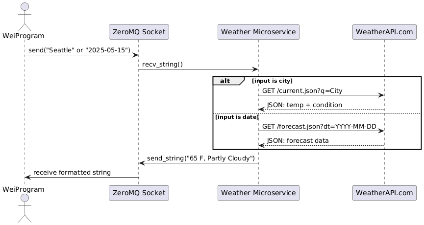

# Weather Microservice (for Wei He)

## Communication Contract

### How to **Programmatically Request** Data from the Microservice

Use ZeroMQ REQ socket to send a **single string**:

* A **city name** (e.g., `"Seattle"`) to get current weather.
* A **date** in `YYYY-MM-DD` format to get the forecast for that date.

#### Example: REQUEST data(Python):

```python
import zmq

context = zmq.Context()
socket = context.socket(zmq.REQ)
socket.connect("tcp://localhost:5555")

while True:
    user_input = input("Enter a city name or date (YYYY-MM-DD): ")
    socket.send_string(user_input)
```

#### Output
Enter a city name or date (YYYY-MM-DD): san diego
Response: 66.9 F, Partly Cloudy

### How to **Receive** Data from the Microservice

After sending a string using ZeroMQ REQ socket, the microservice sends back a **single formatted string**:

#### Example: RECEIVE data(Python):
```python
  import zmq

context = zmq.Context()
socket = context.socket(zmq.REQ)
socket.connect("tcp://localhost:5555")

while True:
    reply = socket.recv_string()
    print("Response:", reply)
```
* On success:

  * Example: `"Response: 66.9 F, Partly Cloudy"`

* On invalid input:

  * Example: `"Response: Error: No matching location found."`

Use `recv_string()` to capture the response.

---

## 🔎 UML Sequence Diagram


---

## How To Access the Microservice

**GitHub Repo**: [https://github.com/stanleyhello/weather-microservice](https://github.com/your-username/weather-microservice)

* Clone the repo
* Run `weather_service.py`
* Your own program should use ZeroMQ to send/receive messages

